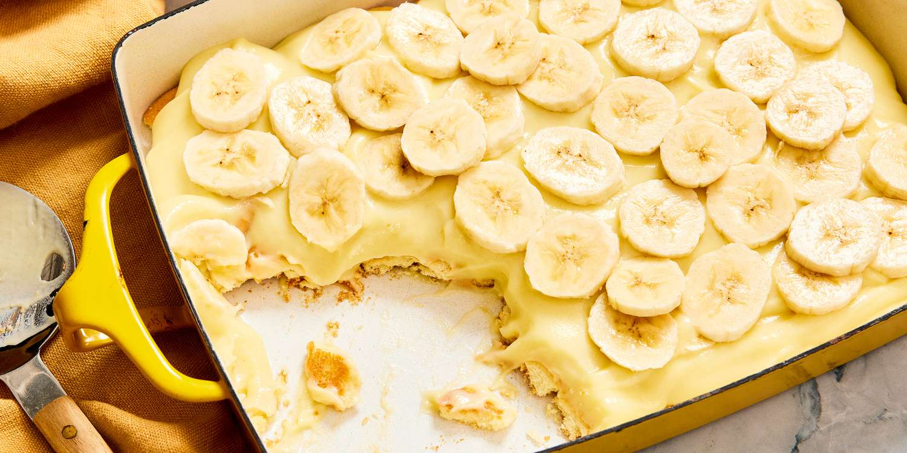

# Grandma's Famous Banana Pudding

Author: Dalton Blackwelder

> banana pudding so good you forget all your problems

img src= "C:/Users/blackwelder/Pictures/ban pudding.png" width=250

<!-- If your image is too big, you can use HTML -->
<!--  -->

## Ingredients

- Sour Cream
- Vanilla Waffer Cookies (2-3 weeks old preference)
- 4-5 Aging Bananas (almost completely brown/black)
- Whipped Cream
- Jell-O brand Banana Flavored Filling (makes 1 Quart)
- 2 cups of Sugar

## Directions

1. Peel bananas
2. Place bananas in a mixing bowl or deep dish
3. Mash bananas up with a mashing tool or mixing tool
4. Add in sour cream, mix in well till creamy
5. Crush up and add in vanilla waffers, need to be half size or smaller
6. Mix up Jell-O mix seperately and then add to overall mix
7. layer the whipped cream on middle and top of the pudding
8. cover with plastic wrap and let sit overnight for min. of 24hrs.
9. Enjoy!
10. Serve it!

